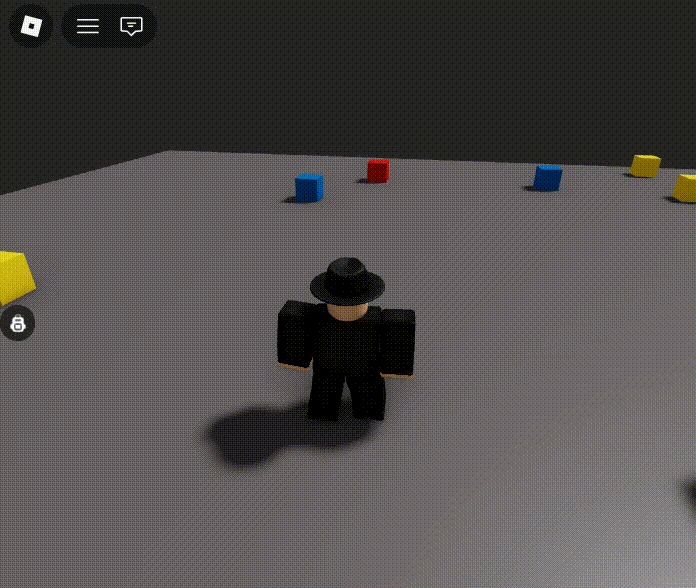
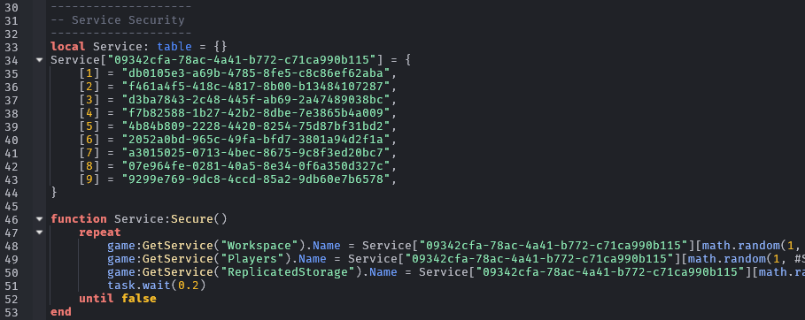
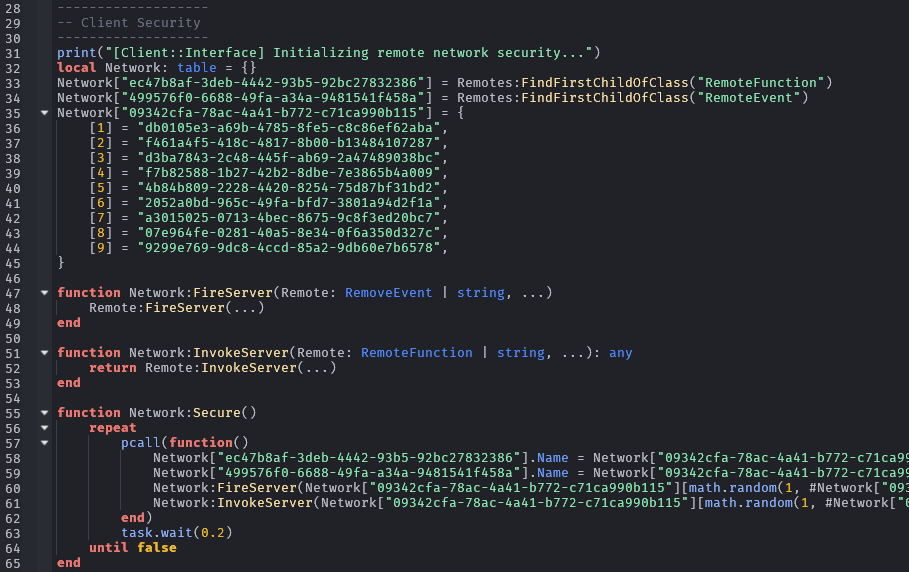
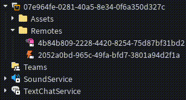
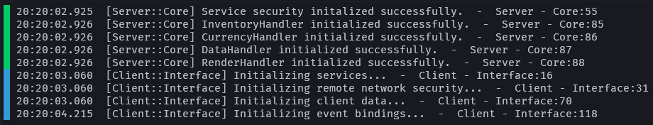

## Roblox System Demo
### Introduction
A small showcase of an implementation of modular utilities that handle inventory management, currency management, data persistence, interface management, localized rendering, and exploit prevention.
  

  
If you wish to see this system in action, you can play the demo [here](https://www.roblox.com/games/85991830273617).
## Script Definitions
### Core
This is the top-level server script with the highest precedence and is responsible for managing things such as:
- Native Service Security
- Module Initialization
- Module Interoperability
- A/B Mode Testing

### Interface
This is the lone local script that handles all of the needs of the client, such as:
- Remote Event Obfuscation
- User Input Management
- Collision Detection

 
### Debug Utility
This is a server module that handles logging for debugging purposes, and supports three logging types: `Log`, `Warn`, and `Error`.
We have also adopted a functional approach for the calling environment checking by parameterizing it as the first argument.
Each calling environment has the format of `<ModuleName>::<FunctionName>`, followed by a contextual error message.
  

 
### Core Handlers
This system focuses on these four modules as it's baseline for functionality in most game types:
- **CurrencyHandler** — A module for setting up any virtual currency types for Roblox's 'leaderstats'.
- **DataHandler** — A module for data saving with release mode switching support for debugging.
- **InventoryHandler** — A module for inventory management with support for client-side model rendering and string-based instance references for switching between native data types.
- **RenderHandler** — A module for rendering objects at random locations located in Workspace.

## License
[CC0-1.0](https://raw.githubusercontent.com/tobynetizen/rbx-system-demo/refs/heads/main/LICENSE)
